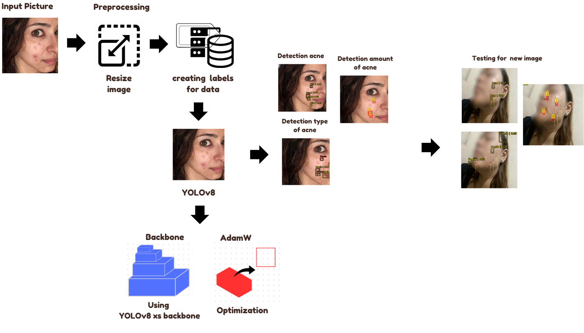
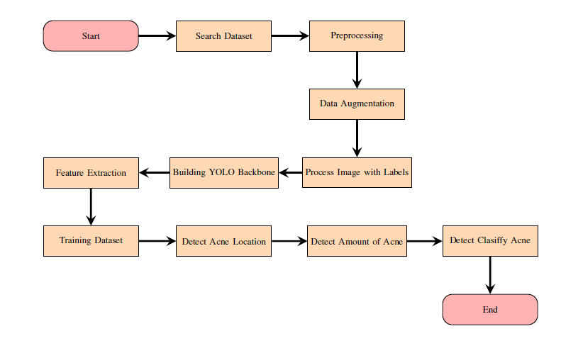
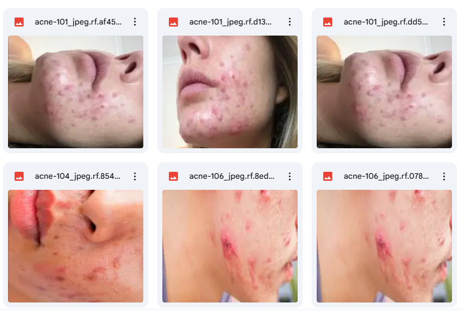
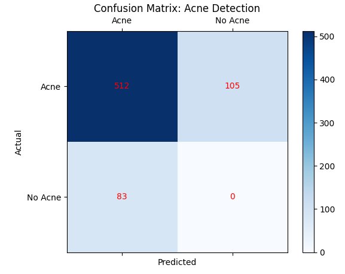

## Thesis: Analyzing Performance YOLOv8 in Detection, Amount, and Type of Acne Lesions

### About This Project
Acne is one of the most common skin diseases and
usually appears on the facial area. The onset of acne is caused
by oily skin conditions and excessive pores, resulting in the
appearance of small bumps. Acne has 5 types, namely whiteheads,
blackheads, nodules, pustules, and papules. Although
the five types of acne have different characteristics, there are
still dermatologists who make mistakes in making diagnoses,
making it difficult for dermatologists to provide the right
diagnosis. This research uses the YOLOv8 model. YOLOv8 has
broad potential in the field of dermatology, because this model
can detect objects of various sizes and has accurate and efficient
performance results to reduce diagnostic errors that previously
often occurred due to differences in the characteristics of
five types of acne. In addition, YOLOv8 is a model that can
perform several tasks at once such as quantitative analysis,
segmentation, and classification of acne. Therefore, this study
performs three detections, namely acne detection, number, and
type of acne. The data used for the three detections contains
823 images of people who have acne and labels to help the
process of detecting acne and acne type. The accuracy produced
by this model is 89% for the detection of acne, 82% for the
number of acne, and 49% for the type of acne. However, the
detection of acne types resulted in low accuracy due to an
imbalance in the number of labels, similarity between acne
types, errors in labeling, poor selection of hyperparameters,
and a less diverse dataset. Future efforts should be able to
correct dataset imbalances, such as the number of datasets,
labeling acne type classes evenly to improve detection results
by producing better accuracy, using the right hyperparameters,
and data augmentation. This study confirms that YOLOv8 can
improve the efficiency of dermatologists in diagnosing accurate
acne so that patients can receive appropriate treatment.
Index Terms—YOLOv8, acne, acne detection, deep learning,
dermatology

### Architecture and Flowchart
- flowchart

- methodology

### Dataset
The dataset used in this paper was derived from Kaagle
and published by a Kaagle user named Arturo Bandini.
Kaagle is a platform which consists with various sources of
scientific data projects to make it easier for someone to find
data without having to search and collect the data themselves. After choosing the dataset to be used, the dataset was
saved in Google Drive to facilitate the preprocessing and
implementation of the YOLOv8 model

- example dataset

### Result

- confussion matrix
